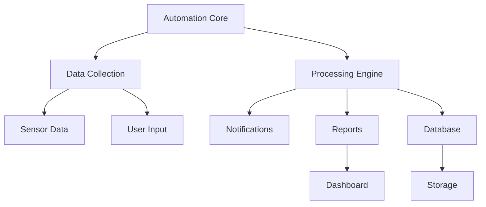

```mermaid
graph TD;
    A[Automation Core] --> B[Data Collection];
    A --> C[Processing Engine];
    B --> D[Sensor Data];
    B --> E[User Input];
    C --> F[Notifications];
    C --> G[Reports];
    C --> H[Database];
    H --> I[Storage];
    G --> J[Dashboard];
```